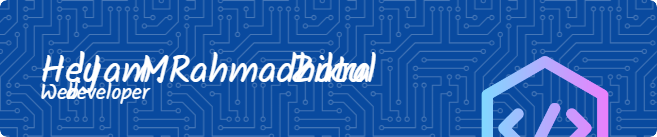

###

<h3 align="left">About me</h3>

####

a Bachelor of Computer Systems graduate from Universitas Putra Indonesia "YPTK" Padang. I am interested in pursuing a career in Network Engineering, Cyber Security, Web Developer and IT Support. I am organized, highly motivated, and responsible. Furthermore, I have 1 year of freelance experience offering application and robotics development services. I am skilled in operating various IT platforms and am able to manage and work in teams across various activities, which has encouraged me to acquire excellent communication and leadership skills.

###

<h2 align="left">Skill</h2>

####

  
  
  
  
  
  
  
  
  
  
  
  
  
  
  

###

  
  

###

  
  

###

<picture>
  <source media="(prefers-color-scheme: dark)" srcset="https://raw.githubusercontent.com/Rahmadhatulzikra/Rahmadhatulzikra/output/pacman-contribution-graph-dark.svg">
  <source media="(prefers-color-scheme: light)" srcset="https://raw.githubusercontent.com/Rahmadhatulzikra/Rahmadhatulzikra/output/pacman-contribution-graph.svg">
  
</picture>

###